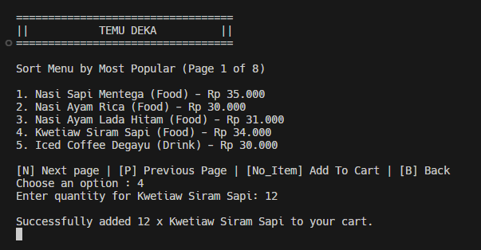

# Cafe Shop (TEMU DEKA) CLI Application in Go

This project was developed by Yusuf Bahtiar. It is a Command-Line Interface (CLI) application built using the Go programming language, designed to simulate a coffee shop system. The application allows users to browse and order menu items from a customer’s perspective, as well as manage items from an admin’s perspective.

Core Features:

1. User Authentication

   - Register
   - Login (with 3x login attempt limit)

2. Menu Interaction

   - Search Item (by name)
   - Filter Item (by category)
   - Sort Item :  
     • Most Popular  
     • Cheapest Price  
     • Most Expensive Price  
     • Name A–Z (Ascending)  
     • Name Z–A (Descending)
   - Pagination support for all views
   - Add to Cart (from All Menu, Search, Filter, and Sort)

3. Cart Management
   - View Cart
   - Remove Item from Cart
   - Checkout

## Preview




## Prerequisites

Make sure you already install Go to run this project

## How to Run

1. Clone this project

```bash
git clone https://github.com/yusufbahtiarr/fgo24-go-bookingmenu-cli.git
```

2. Enter the project directory

```bash
cd fgo24-go-bookingmenu-cli
```

3. Run the project

```bash
go run main.go
```

## License

This project following MIT License

## Copyright

&copy; 2025 Kodacademy
